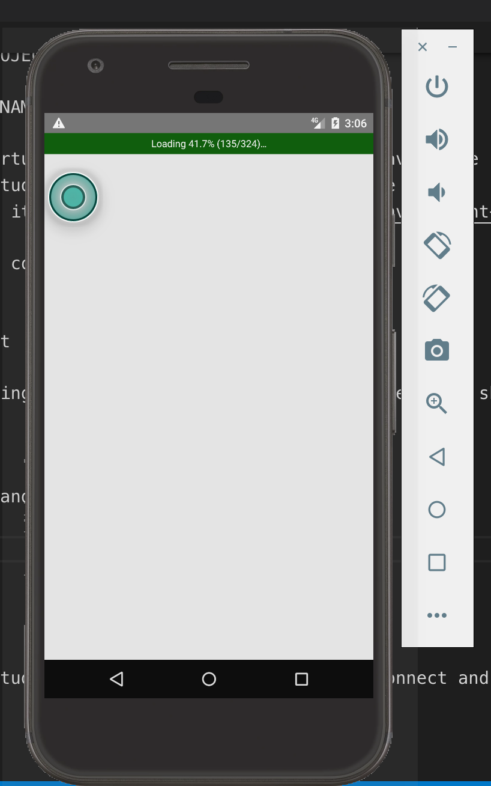
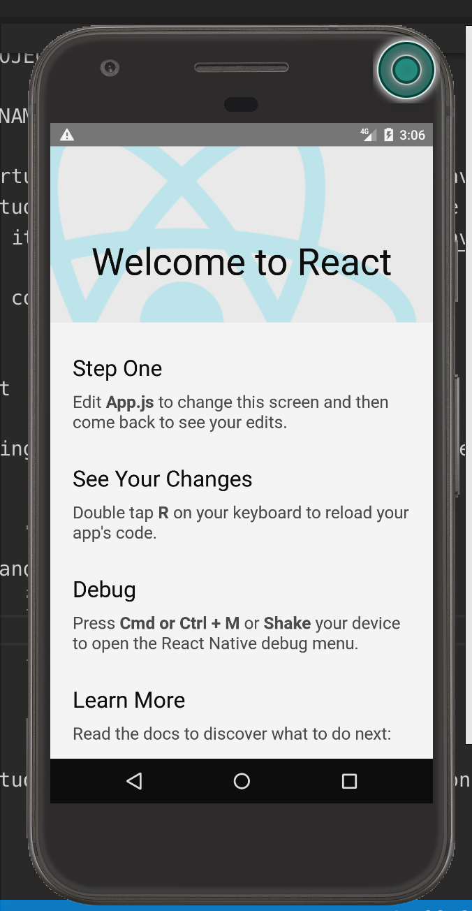
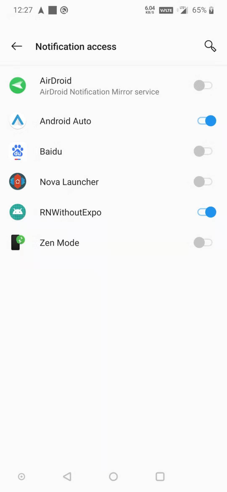

# Intro

Following:
 - "React Native - The Practical Guide [2020 Edition]"(Udemy, https://www.udemy.com/course/react-native-the-practical-guide/learn/lecture/15738488#overview), starting at section 13
 - https://reactnative.dev/docs/environment-setup

# Steps
1. Install react-native-cli
```
sudo npm install -g react-native-cli
```

2. Initialize project
```
react-native init <PROJECT_NAME>
```
 - Note that PROJECT_NAME cannot have dashes.etc.

3. Prepare Android Virtual Device (or Apple, but I don't have Apple right now)
 - Download Android Studio -> Set up and Run Virtual Device 
   - (Read more about it in https://reactnative.dev/docs/environment-setup)

4. Run a few terminal commands

```
npx react-native start
```
 - This starts something called Metro (the JavaScript bundler that ships with React Native).

```
npx react-native run-android
```
 - This will install the app onto the virtual android device.




```
npx react-native run-ios
```
 - This will start an iPhone simulator, install app and run it.

5. Things to note about the structure of the project.
 - 

# Integrating Android Notification Listener
 - https://github.com/leandrosimoes/react-native-android-notification-listener

```
yarn install react-native-android-notification-listener
react-native link react-native-android-notification-listener
```
 - Install react-native-android-notification-listener

```js
const [hasPermission, setHasPermission] = useState(false);
const [lastNotification, setLastNotification] = useState(null);
```
 - First, we create 2 variables(hasPermission and lastNotification) and their setters.

```js
const handleOnPressPermissionButton = async () => {
  // This will request for permission. User will be directed to a page to enable notification access.
  RNAndroidNotificationListener.requestPermission();
};

const handleNotificationReceived = notification => {
  // When we receive a notification, we log it and set it to lastNotification.
  console.log(notification);
  setLastNotification(JSON.stringify(notification));
};
```
 - Then, we create the functions to execute:
   - handleOnPressPermissionButton:
     - This will request for permission. 
     - User will be directed to a page to enable notification access (screenshot shown below)



   - handleNotificationReceived:
     - Determines what to do with the notification received.
     - In this case, we log it and set it to lastNotification.

```js
const handleAppStateChange = async nextAppState => {
  // When there is a change in app state, we check permission status and update hasPermission.
  RNAndroidNotificationListener.getPermissionStatus().then(status => {
    setHasPermission((status !== 'denied').toString());
  });
};
```
   - handleAppStateChange:
     - When there is a change in app state, we update hasPermission variable.
     - To be honest, this method is kind of use-less; other than updating hasPermission variable.

```js
useEffect(() => {
  // Check permission status once screen is rendered.
  RNAndroidNotificationListener.getPermissionStatus().then(status => {
    setHasPermission((status !== 'denied').toString());
    if(status == 'denied'){
      console.error("hasPermission is denied. Need to request for notification permission.");
      // handleOnPressPermissionButton(); // Uncomment this to request permission when it is denied.
    }
  });

  // Link handleNotificationReceived function.
  RNAndroidNotificationListener.onNotificationReceived(
    handleNotificationReceived,
  );

  // Link handleAppStateChange function.
  AppState.addEventListener('change', handleAppStateChange);

  return () => {
    AppState.removeEventListener('change', handleAppStateChange);
  };
}, []);
```
 - When page is rendered, check permission and link functions to listeners.

# Integrate SMS Functionality

```
npm install react-native-get-sms-android --save
react-native link react-native-get-sms-android
```
 - https://github.com/briankabiro/react-native-get-sms-android#readme


**Add permissions to your android/app/src/main/AndroidManifest.xml file**
```xml
<uses-permission android:name="android.permission.READ_SMS" />
<uses-permission android:name="android.permission.WRITE_SMS" />
<uses-permission android:name="android.permission.SEND_SMS" />
```

```js
import {PermissionsAndroid} from 'react-native';
import SmsAndroid from 'react-native-get-sms-android';
```
```js
const [smsList, setSmsList] = useState([]);
```

```js
// Check Read and Send SMS permission.
async function checkPermissions() {
  console.log("checking SMS permissions");
  let hasPermissions = false;
  try {
    hasPermissions = await PermissionsAndroid.check(
      PermissionsAndroid.PERMISSIONS.READ_SMS
    );
    if (!hasPermissions) return false;
    hasPermissions = await PermissionsAndroid.check(
      PermissionsAndroid.PERMISSIONS.SEND_SMS
    );
    if (!hasPermissions) return false;
  } catch (e) {
    console.error(e);
  }
  return hasPermissions;
};

// Request for Read and Send SMS permission.
async function requestPermissions() {
  let granted = {};
  try {
    console.log("requesting SMS permissions");
    granted = await PermissionsAndroid.requestMultiple(
      [
        PermissionsAndroid.PERMISSIONS.READ_SMS,
        PermissionsAndroid.PERMISSIONS.SEND_SMS
      ],
      {
        title: "Example App SMS Features",
        message: "Example SMS App needs access to demonstrate SMS features",
        buttonNeutral: "Ask Me Later",
        buttonNegative: "Cancel",
        buttonPositive: "OK"
      }
    );
    console.log(granted);
    if (granted === PermissionsAndroid.RESULTS.GRANTED) {
      console.log("You can use SMS features");
    } else {
      console.log("SMS permission denied");
    }
  } catch (err) {
    console.warn(err);
  }
};

async function handleOnPressListSMSButton(){
  console.log("handleOnPressListSMSButton");
  if (Platform.OS === "android") {
    try {
      if (!(await checkPermissions())) {
        await requestPermissions();
      }

      if (await checkPermissions()) {
        listSMS();
      }
    } catch (e) {
      console.error(e);
    }
  }
};
```

```jsx
<View style={styles.sectionContainer}>
  <Button title="List SMS" onPress={handleOnPressListSMSButton}/>
  <Text>{JSON.stringify(smsList)}</Text>
</View>
```
 - Display smsList.
 - **TODO: ** Figure out how to display the sms in a nice way. (Require dynamic loading of a component).


# Solutions

## Installing on ios

1. go to ios folder, run 'pod install'
2. cd .. and run 'react-native run-ios'

## [Solution] Flipper Problem when running ios simulator:

1. This issue is caused by an update to the "Flipper-Folly" pod-spec. If you'd like to keep Flipper enabled, you can override the version in your Podfile:

```
cd ios
vim PodFile
(replace use_flipper! with use_flipper!({ 'Flipper-Folly' => '2.3.0' }))
```

 - Source: https://github.com/facebook/react-native/issues/30836

2. rm -rf PodFile.lock -> pod install

Source: https://github.com/invertase/react-native-firebase/issues/3673
